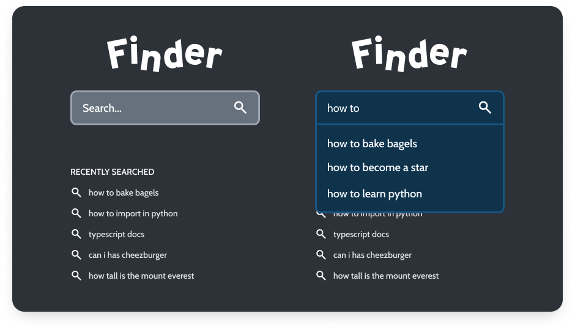

# Hey, there!

Regards from the Starlight team! We created this test to have an overall idea of how you design solutions and write your
code. It's fairly simple and it shouldn't take a lot of your time.

## What is it about?

Your task is to create a "search" web app that receives user input and shows a list of related suggestions, just like
the suggestions we see below Google's search bar as we type. A back-end should allow users to create suggestion strings 
and later search within these suggestions. Clicking on a suggestion should add it to a list of "recently searched items".

## What are the requirements, then?

You should implement the auto-complete feature using the following design as a guideline:



You should access the Figma file to see all design assets: 
https://www.figma.com/file/rMQM5mMH9VK97kLzIc45jb/Frontend-Test-Mockup?node-id=0%3A1.

> Tip: if you create a Figma account and access the design file, you can create a copy and inspect it. This way, you can
> easily extract all colors, fonts, sizings, spacings, etc.

### Front-end

Try to follow the design as closely as possible, but it doesn't have to be pixel perfect. We prefer that you focus your
efforts in delivering a good and bug-less "search" experience.

Note that the design is mobile-first but the desktop design is the same as on mobile viewports, except it doesn't get
wider than 420 pixels. There's a desktop mockup in the design showing exactly that, just beside the mobile mockups.
Apart from the max-width, everything should look the same as on mobile.

That being said, here's what we expect:

- A single page application showing a centralized logo, a search input, and a list of recently searched items.
    - You can grab the logo and search icons in the `public` folder at the root of this repository.
    - The correct fonts are already imported, take a look at the `styles.css` file in the src folder.
- When the user starts typing in the search field, it should search for suggestions that start with the user input.
    - If there's any suggestions, show them in the suggestion dropdown. Order suggestions alphabetically and limit to 3
      suggestions.
    - If there's no matching suggestion, simply don't show the dropdown.
- After the user submits the search query by pressing `Enter` or clicking on a suggestion, add it to a list of recently
  searched items.
    - If the user presses `Enter`, add the current user input into the recent list, even if there's no suggestion that
      matches the input.
    - If the user clicks on a suggestion, add the suggestion text into the recent list.
    - Either way, after adding the query into the recent list, reset the search input element.
- Show all recently searched items in a simple list.
    - Limit the list to the last five searched items, removing older ones first.
    - There's no need to persist the list in any way. Refreshing the page should reset it.

This repository has a simple React application ready to be used. Just run `npm insall`, then `npm run start` and hack
away. We included a super simple layout and some initial styles to help you get started.

The provided starter app uses Typescript, but feel free to disable it if you want. Actually, you don't even have to use
React: you can use any framework you like, like Vue, Angular, etc. Just make sure to update this README file with
instructions on how to start your app if you do so.

### Back-end

You should implement a back-end that provides suggestions to the front-end based on what the user typed. It should be
really straight-forward, and here's what we expect:

- A `POST` API route that receives a string of text (a suggestion) and saves it into the database.
    - There's no need to implement authentication or authorization. We want this test to be simple, after all.
    - The controller should validate the given data using these rules:
        - The given data should be a string.
        - The string should not be empty.
        - The string should have at least 3 characters.
        - The string should be unique (which means that it should not already exist in the database).
    - If the string is valid and unique, save it into the database.
        - Don't forget to include database migrations with your code! We will run them before trying to use your app.
- A `GET` API route that receives a string (the text written by the user) and responds with an array of suggestions.
    - The route should search the given string in the database table where suggestions were saved by the `POST` route.
    - The search should match the given text in any part of the suggestion. That is, if the user provides the string
      `"dog"`, it should match both `"dog memes"` and `"how to train dogs"`.
    - You can find a list of suggestions in the `suggestions.json` file at the root of this repository. You don't need
      to use this file anywhere, but you can you use it as a reference if you're out of ideas when creating test
      suggestions.

As with the front-end, we also provided a simple, ready-to-use Laravel installation in the `backend` folder. However,
take note that the provided back-end is a clean Laravel installation with no further changes. We included it so you
don't have to lose time creating a new installation and organizing it inside this project.

To run the app easily, you can use [Laravel Sail](https://laravel.com/docs/9.x/sail). Before doing so, you need to
install all dependencies using this command on Mac, Linux or WSL2:

```shell
# enter the laravel folder
cd backend

# install all dependencies
docker run --rm \
    -u "$(id -u):$(id -g)" \
    -v $(pwd):/var/www/html \
    -w /var/www/html \
    laravelsail/php81-composer:latest \
    composer install --ignore-platform-reqs
```

After this, you can use Sail to manage the app:

```shell
# start the app
./vendor/bin/sail up -d

# stop the app
./vendor/bin/sail stop
```

The app should listen to `localhost:80`, so accessing it should be as easy as typing
[http://localhost](http://localhost) in your browser. You can learn more
in [Sail's documentation page](https://laravel.com/docs/9.x/sail#starting-and-stopping-sail). 
Also, make sure to read the [create a shell alias](https://laravel.com/docs/9.x/sail#configuring-a-shell-alias)
section to make your life easier. 

## Anything else?

Not really, that's pretty much it.

To start coding, create a fork of this repository, clone it locally and start hacking away. When you're done, push your
work to a public repository and share its URL with us by replying the e-mail we sent you with this test. We'll let you
know when we receive your message.
